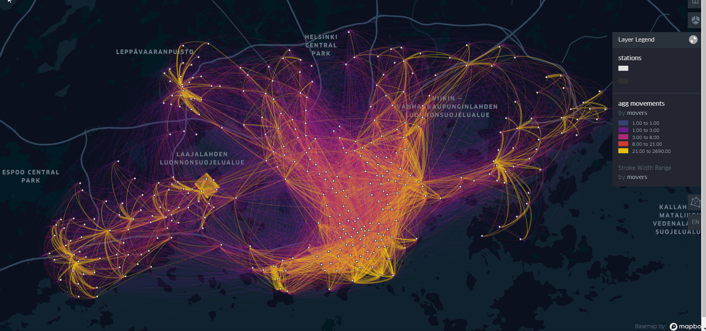

# Interactive Flow-map of Aggregated Bike Movements between Bike Stations in Helsinki Region

## Aim
The aim of this practice is to visualize with an interactive flow-map the aggregated movements of the Bike Sharing System trip data for understanding the Bike usage dynamics in Helsinki

## Results

***Final map animation:*** https://bryanvallejo16.github.io/bike-movements-helsinki/

***Tutorial:*** https://towardsdatascience.com/visualization-of-bike-sharing-system-movements-in-helsinki-with-an-interactive-flow-map-451d897104fe

## Final map

#### You can support my work by buying me a coffee

